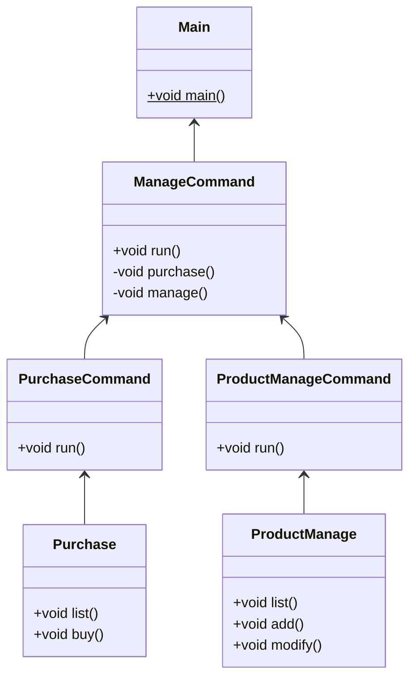

## Step1で作成したクラスを、「メイン」「コマンド」「購入」「在庫管理」の4種類のクラスにリファクタリングする
### 以下は、モデリングの例になります。

```mermaid
classDiagram
    Main <-- ManageCommand
    ManageCommand <-- PurchaseCommand
    PurchaseCommand <-- Purchase
    ManageCommand <-- ProductManageCommand
    ProductManageCommand <-- ProductManage
    class Main {
      +void main()$
    }
    class ManageCommand {
      +void run()
      -void purchase()
      -void manage()
    }
    class PurchaseCommand {
      +void run()
    }
    class Purchase {
      +void list()
      +void buy()
    }
    class ProductManageCommand {
      +void run()
    }
    class ProductManage{
      +void list()
      +void add()
      +void modify()
    }
```
