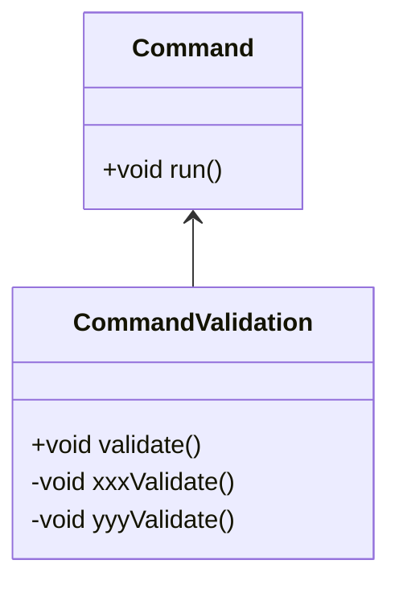

# Step4 バリデーションクラスの追加
### 各コマンドや購入のバリデーションクラスを作成し、バリデーションクラス内で入力チェックを行う

クラス構成のイメージは以下。

```mermaid
classDiagram
    Command <-- CommandValidation

    class Command {
      +void run()
    }
    class CommandValidation {
      +void validate()
      -void xxxValidate()
      -void yyyValidate()
    }
```
